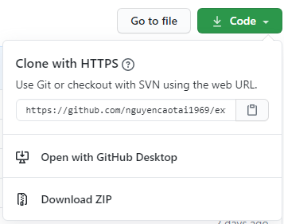
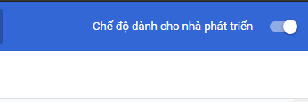
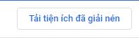

Mail Auto Chrome Extension.

Với hơn 550.234 ngàn người sử dụng mỗi năm.

Mail Auto là dự án mã nguồn mở của mình, các bạn có thể cài đặt và sử dụng hoàn toàn miễn phí. Tuy nhiên nghiêm cấm hành vi dùng mà nguồn của mình vào việc thương mại hóa, chuộc lợi cho bản thân

Mã nguồn sẽ được cập nhật thường xuyên tại đây
Extension cực kì nhẹ, chỉ với 50kb

Nếu bạn muốn trải nghiệm phiên bản Pro, xin vui lòng liên hệ mình với thông tin bên dưới.

<b style="color: red">Nghiêm cấm sử dụng mã nguồn này trong việc thương mại hóa, hãy tôn trọng quyền tác giả.
</b>

<b>Block Features.</b>
Gồn Các Chức Năng Sau :

Nhận Mail tự động cho các bạn tha hồ đăng kí nik clone facebook <3

Boot Auto reaction tự động cho các bạn lười tương tác chỉ với 1 click thì nó sẽ tự động hoạt động tha hồ làm những việc khác <3 

Chụp Ảnh Màn Hình Trang Web :

Auto To Like Tự Động Chỉ Cần Điền ID Bài Viết Là Nó Sẽ Lên Ngày Lập Tức .

Feature :

Thêm Chức Năng Oẳn Tù tì lột đồ gái xinh <3 ở bên góc phải trên cùng của tiện ích <3

dưới đây là hướng dẫn cài đặt trình extension :

Ai Vẫn Không cài đặt được thì có thể ib trực tiếp facebook cho mình nhé : https://www.facebook.com/nguyencaotai1969

Bước 1: Vào cmd hoặc terminal : git clone https://github.com/nguyencaotai1969/extension_automail

hoặc download zip tại phần code 

Bước 2: Sau khi giải nén file vừa tải về Gõ trên thanh địa chỉ chrome://extensions/

Bước 3: Bật chế độ dành cho nhà phát triển ( Developer Mode ) ở góc phải màn hình

Bước 4: Ấn Tải tiện ích đã giải nén bên góc trái ( Load unpacked )

Bước 5: Chọn thư mục bạn vừa clone ở Bước 1 rồi submit

Bước 6: Quay Lại Facebook rồi dùng thử nhé :v

Developer

Nguyễn Cao Tài